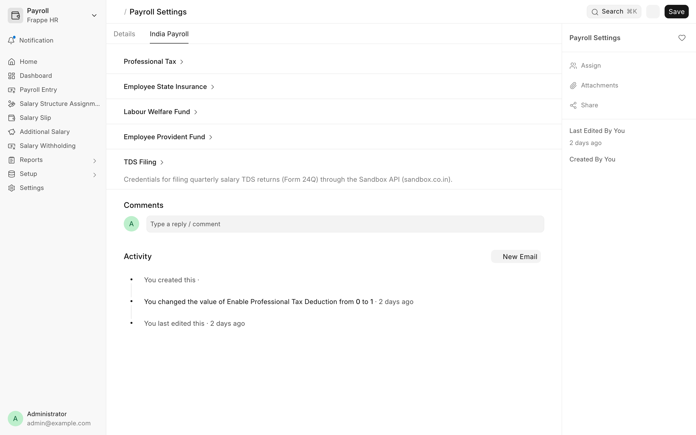
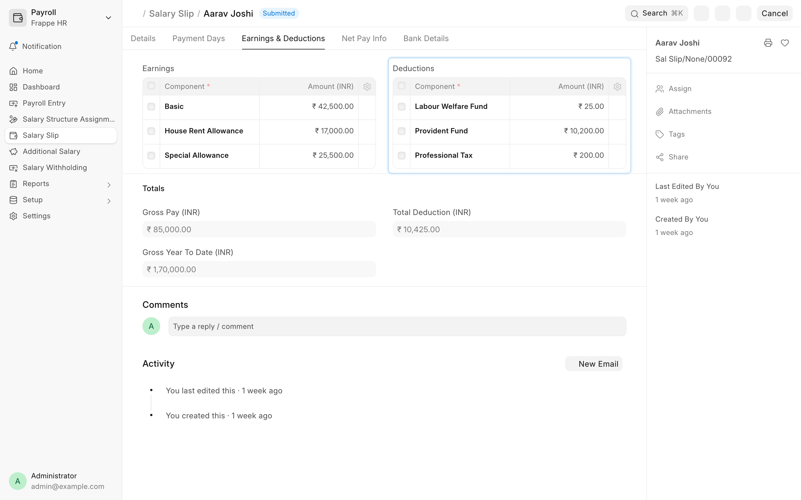
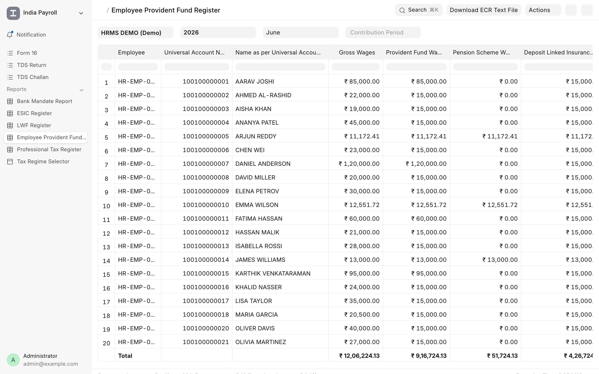
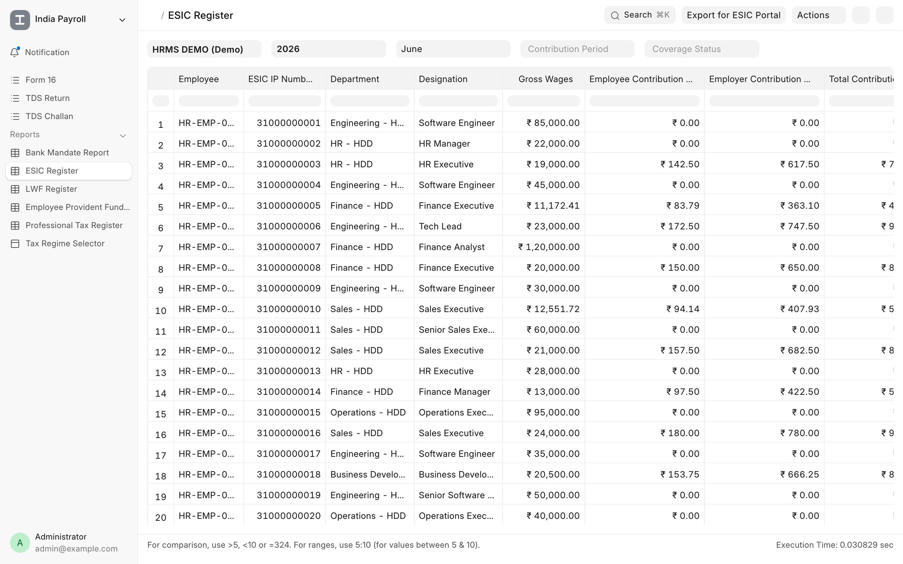
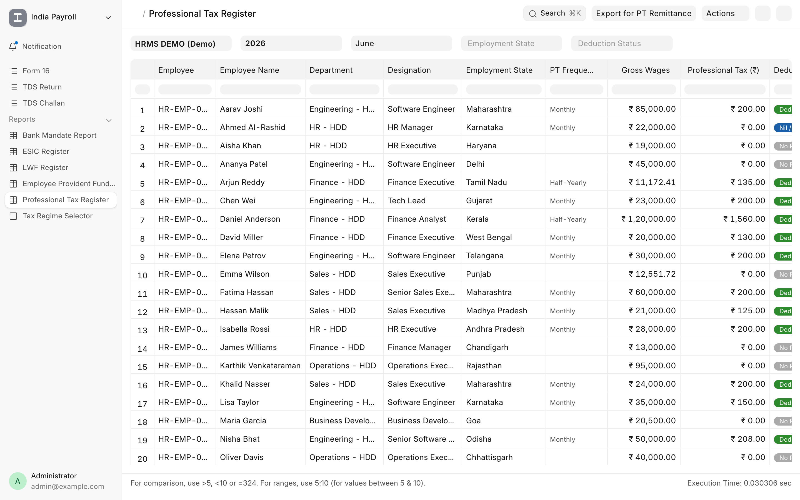
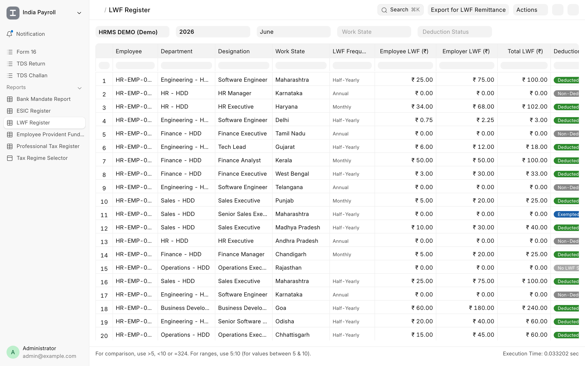
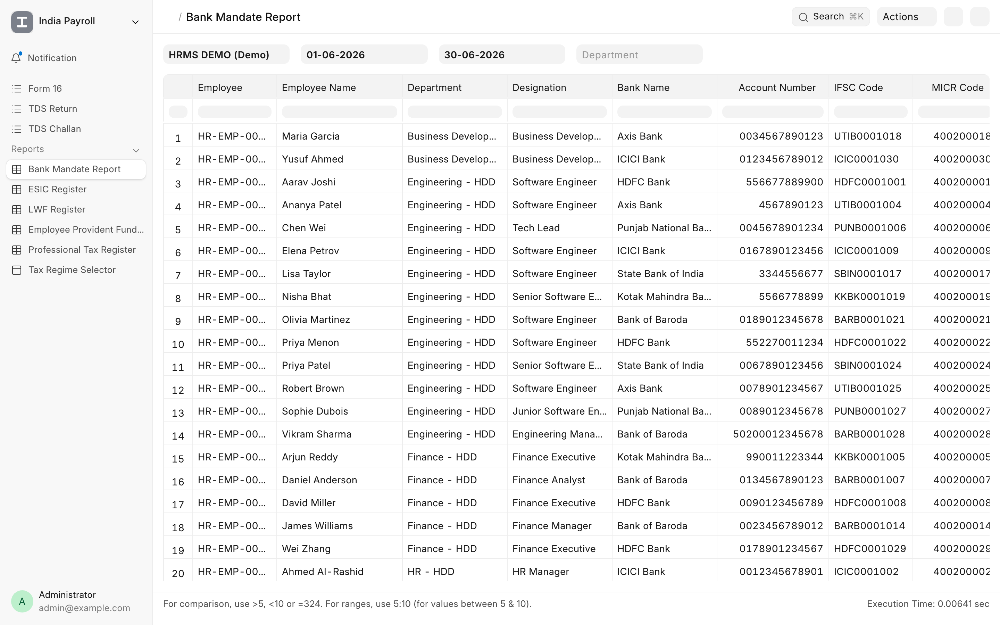
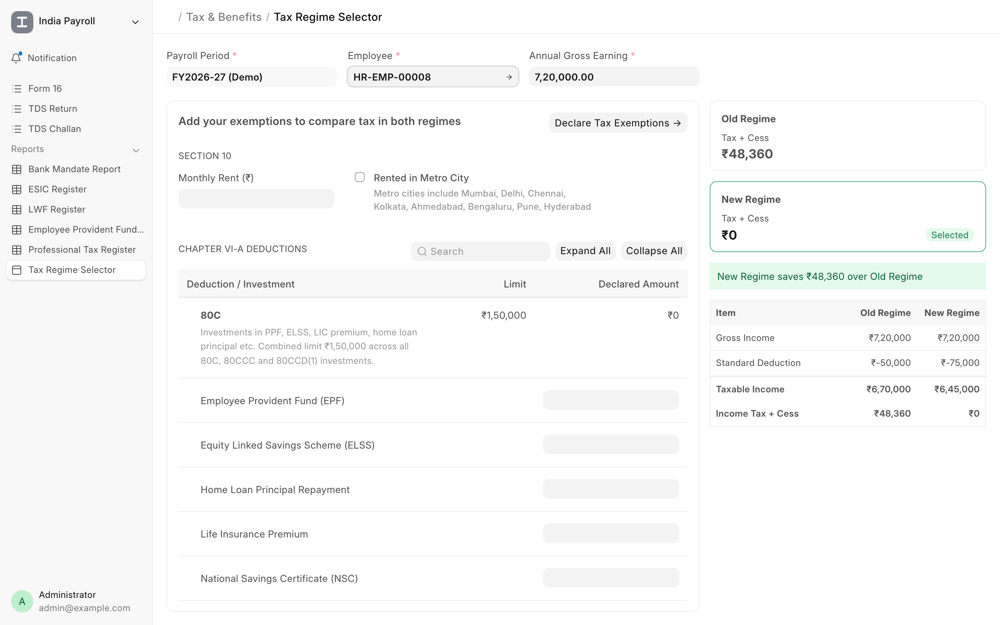

<div align="center">
	<h2>India Payroll</h2>
	<p align="center">
		<p>Indian statutory payroll and taxation for Frappe HR</p>
	</p>

[](https://www.gnu.org/licenses/gpl-3.0)

</div>

<div align="center">
	
</div>

<div align="center">
	<a href="https://frappe.io/hr">Website</a>
	-
	<a href="docs">Documentation</a>
</div>

## India Payroll

India Payroll extends [Frappe HR](https://github.com/frappe/hrms) with the statutory schemes and tax rules that Indian businesses are required to follow. Once configured, the correct deductions appear on every salary slip automatically and flow straight into the compliance reports and returns.

## Motivation

Indian payroll is governed by a web of statutory rules: provident fund ceilings, state-wise professional tax and labour welfare fund slabs, employee state insurance thresholds, income tax regimes, and quarterly TDS returns. Most of this is sold as expensive, closed software. India Payroll brings it to Frappe HR as a free and open-source layer, so you can run compliant payroll without scripting a single salary formula.

## Key Features

- **Employee Provident Fund (EPF)**: Calculates employee EPF and Voluntary Provident Fund on every salary slip, applies the wage ceiling, reconstructs the employer split (EPF, EPS, EDLI and admin charges), and exports a ready-to-upload ECR file for the EPFO portal.
- **Employee State Insurance (ESI)**: Deducts the combined ESI contribution for employees within the wage ceiling, with coverage decided on the full monthly gross so a high earner is not wrongly pulled in during a loss-of-pay month.
- **Professional Tax**: A state-wise slab engine covering monthly and half-yearly states, including special rules such as Maharashtra's February charge and women exemption thresholds.
- **Labour Welfare Fund (LWF)**: State-wise employee and employer contributions, applied at the correct monthly, half-yearly, or annual frequency for each state.
- **Income Tax and TDS**: New and old regime slabs, surcharge with marginal relief, quarterly TDS return (Form 24Q) e-filing through the Sandbox API, and Form 16 generation.
- **Tax Regime Selector**: A guided page where employees declare their exemptions and investments, compare the old and new tax regimes side by side, and lock in the regime that lowers their tax.
- **Statutory Reports**: Provident Fund Register (with ECR export), ESIC Register, Professional Tax Register, LWF Register, and Bank Mandate Report, each with its own export for filing with the relevant authority.

<details open>
<summary>View Screenshots</summary>
	
	
	
	
	
	
	
</details>

### Under the Hood

- [**Frappe HR**](https://github.com/frappe/hrms): The open-source HR and Payroll platform that India Payroll builds on. It handles salary structures, payroll processing and income tax, while India Payroll adds the India-specific statutory layer.
- [**Frappe Framework**](https://github.com/frappe/frappe): A full-stack web application framework written in Python and JavaScript, providing the database layer, user authentication and REST API.

## Installation

India Payroll requires [Frappe HR](https://github.com/frappe/hrms) and installs on top of an existing bench.

```bash
cd $PATH_TO_YOUR_BENCH

# Get the app
bench get-app $URL_OF_THIS_REPO --branch develop

# Install it on your site
bench --site $YOUR_SITE install-app india_payroll
```

Installing the app creates the statutory salary components it needs (Provident Fund, VPF, the employer contribution components, Employee State Insurance, Professional Tax and Labour Welfare Fund).

To get started, enable the schemes you need under **Payroll Settings > India Payroll**, then configure each employee on the **India Payroll** tab of their Salary Structure Assignment.

## Learning and Community

1. [Frappe School](https://school.frappe.io): Learn Frappe Framework and Frappe HR from courses by the maintainers and the community.
2. [Documentation](docs): Scheme-by-scheme documentation for India Payroll.
3. [Discussion Forum](https://discuss.frappe.io/c/frappe-hr/91): Engage with the Frappe HR community.

## Contributing

This app uses [pre-commit](https://pre-commit.com/#installation) for code formatting and linting. Please install it and enable it for this repository:

```bash
cd apps/india_payroll
pre-commit install
```

## License

[GNU General Public License v3.0](license.txt)

<br />
<br />
<div align="center" style="padding-top: 0.75rem;">
	<a href="https://frappe.io" target="_blank">
		<picture>
			<source media="(prefers-color-scheme: dark)" srcset="https://frappe.io/files/Frappe-white.png">
			
		</picture>
	</a>
</div>
